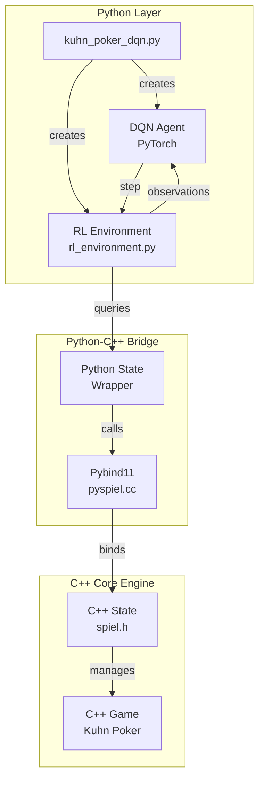
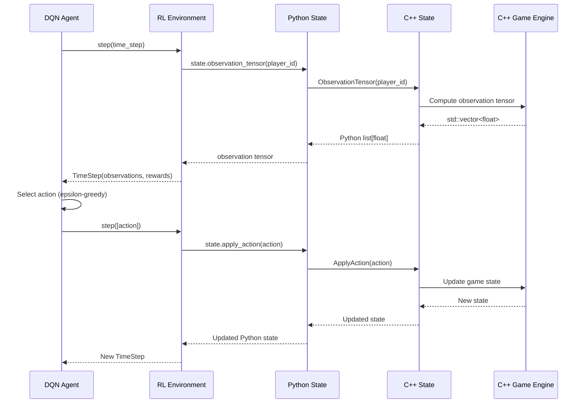

## Test Environment
- MacBook Pro 16 (M2), 32GB RAM

## Prerequisites
- Install [brew](https://brew.sh/)
- Install mise for python dev env: `brew install mise`
- Install python: `mise trust && mise install`

## Setup
- Reference: ./docs/install.md
```bash
git clone git@github.com:Curt-Park/open_spiel.git
cd open_spiel

# Install system packages (e.g. cmake) and download some dependencies
./install.sh
# Building and testing from source
uv pip install -r requirements.txt
./open_spiel/scripts/build_and_run_tests.sh

# Building and testing using PIP
uv pip install .
echo "export PYTHONPATH=$PYTHONPATH:$PWD" >> .venv/bin/activate
echo "export PYTHONPATH=$PYTHONPATH:$PWD/build/python" >> .venv/bin/activate

# Run an example
./build/examples/example --game=tic_tac_toe
```

## Kuhn Poker Example with DQN Agent

### Setup
Install additional packages:
```bash
uv pip install -r a5labs/requirements.txt
```

### Configuration
The script uses a YAML configuration file (`a5labs/config.yaml`) for hyperparameters:
- Network architecture (hidden layers)
- Training hyperparameters (learning rate, batch size, etc.)
- Evaluation settings
- Model save path

### Usage

#### Training Mode (Default)
Train a DQN agent from scratch:
```bash
python a5labs/kuhn_poker_dqn.py
```

Train with custom config file:
```bash
python a5labs/kuhn_poker_dqn.py --config path/to/custom_config.yaml
```

#### Evaluation Mode
Evaluate a trained model:
```bash
python a5labs/kuhn_poker_dqn.py --eval
```

The script will:
1. Load the model from the path specified in `config.yaml`
2. Run evaluation episodes against a random agent
3. Report the average reward

## System Design & Data Flow

The following diagram illustrates the system architecture and data flow for the Kuhn Poker DQN example:



### Data Flow Sequence



### Key Components

1. **Python Layer**: `kuhn_poker_dqn.py` orchestrates the DQN agent and RL environment
2. **RL Environment**: Wraps the C++ game engine with an RL-friendly API
3. **Pybind11 Bridge**: Provides seamless type conversion between C++ and Python
4. **C++ Core Engine**: Implements game logic (Kuhn Poker) and state management
5. **Data Conversion**: Automatic conversion of `std::vector<float>` ↔ Python `list[float]` via Pybind11

## Profiling
top ten functions consuming most compute time.

## Optimization
.