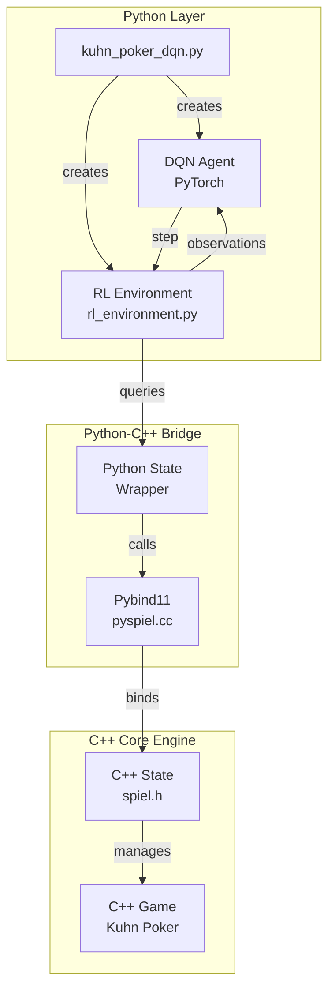
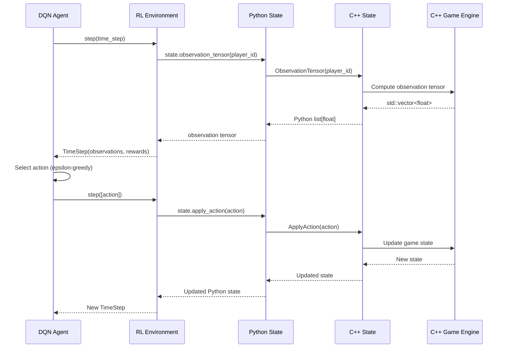
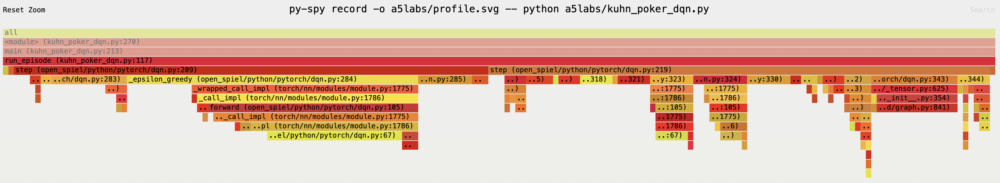

## Test Environment
- MacBook Pro 16 (M2), 32GB RAM

## Prerequisites
- Install [brew](https://brew.sh/)
- Install mise for python dev env: `brew install mise`
- Install python: `mise trust && mise install`

## Setup
- Reference: ./docs/install.md
```bash
git clone git@github.com:Curt-Park/open_spiel.git
cd open_spiel

# Install system packages (e.g. cmake) and download some dependencies
./install.sh
# Building and testing from source
uv pip install -r requirements.txt
./open_spiel/scripts/build_and_run_tests.sh

# Building and testing using PIP
uv pip install .
echo "export PYTHONPATH=$PYTHONPATH:$PWD" >> .venv/bin/activate
echo "export PYTHONPATH=$PYTHONPATH:$PWD/build/python" >> .venv/bin/activate

# Run an example
./build/examples/example --game=tic_tac_toe
```

## Kuhn Poker Example with DQN Agent

### Setup
Install additional packages:
```bash
uv pip install -r a5labs/requirements.txt
```

### Configuration
The script uses a YAML configuration file (`a5labs/config.yaml`) for hyperparameters:
- Network architecture (hidden layers)
- Training hyperparameters (learning rate, batch size, etc.)
- Evaluation settings
- Model save path

### Usage

#### Training Mode (Default)
Train a DQN agent from scratch:
```bash
python a5labs/kuhn_poker_dqn.py
```

Train with custom config file:
```bash
python a5labs/kuhn_poker_dqn.py --config path/to/custom_config.yaml
```

#### Evaluation Mode
Evaluate a trained model:
```bash
python a5labs/kuhn_poker_dqn.py --eval
```

The script will:
1. Load the model from the path specified in `config.yaml`
2. Run evaluation episodes against a random agent
3. Report the average reward

## System Design & Data Flow

The following diagram illustrates the system architecture and data flow for the Kuhn Poker DQN example:



### Data Flow Sequence



### Key Components

1. **Python Layer**: `kuhn_poker_dqn.py` orchestrates the DQN agent and RL environment
2. **RL Environment**: Wraps the C++ game engine with an RL-friendly API
3. **Pybind11 Bridge**: Provides seamless type conversion between C++ and Python
4. **C++ Core Engine**: Implements game logic (Kuhn Poker) and state management
5. **Data Conversion**: Automatic conversion of `std::vector<float>` ↔ Python `list[float]` via Pybind11

## Profiling

```bash
# line profiling
$ kernprof -l -v a5labs/kuhn_poker_dqn.py

# sampling profiler
$ sudo py-spy record -o a5labs/profile.svg -- python a5labs/kuhn_poker_dqn.py 
```

### Line Profiling Result
```bash
Timer unit: 1e-06 s

Total time: 7.7085 s
File: a5labs/kuhn_poker_dqn.py
Function: run_episode at line 103

Line #      Hits         Time  Per Hit   % Time  Line Contents
==============================================================
   103                                           @profile
   104                                           def run_episode(
   105                                               env: rl_environment.Environment,
   106                                               agent: dqn.DQN,
   107                                               opponent: random_agent.RandomAgent,
   108                                               is_evaluation: bool = False,
   109                                           ) -> float:
   110                                               """Run a single episode and return the final reward.
   111                                           
   112                                               Args:
   113                                                   env: RL environment instance
   114                                                   agent: DQN agent (player 0)
   115                                                   opponent: Opponent agent (player 1)
   116                                                   is_evaluation: Whether this is an evaluation episode
   117                                           
   118                                               Returns:
   119                                                   Final reward for player 0
   120                                               """
   121     25000     884215.0     35.4     11.5      time_step = env.reset()
   122                                           
   123                                               # Run episode until terminal state
   124     76801      51566.0      0.7      0.7      while not time_step.last():
   125     51801      13388.0      0.3      0.2          player_id = time_step.observations["current_player"]
   126                                           
   127     51801      12310.0      0.2      0.2          if player_id == 0:
   128                                                       # DQN agent's turn
   129     26801    3347534.0    124.9     43.4              agent_output = agent.step(time_step, is_evaluation=is_evaluation)
   130     26801       9183.0      0.3      0.1              action_list = [agent_output.action]
   131                                                   else:
   132                                                       # Opponent agent's turn
   133     25000     346752.0     13.9      4.5              agent_output = opponent.step(time_step, is_evaluation=is_evaluation)
   134     25000       8165.0      0.3      0.1              action_list = [agent_output.action]
   135                                           
   136     51801     978383.0     18.9     12.7          time_step = env.step(action_list)
   137                                           
   138                                               # Send final state to agents at episode end
   139     25000    2015379.0     80.6     26.1      agent.step(time_step, is_evaluation=is_evaluation)
   140     25000      29396.0      1.2      0.4      opponent.step(time_step, is_evaluation=is_evaluation)
   141                                           
   142                                               # Return player 0's reward
   143     25000      12229.0      0.5      0.2      return time_step.rewards[0]

Total time: 9.0107 s
File: a5labs/kuhn_poker_dqn.py
Function: main at line 167

Line #      Hits         Time  Per Hit   % Time  Line Contents
==============================================================
   167                                           @profile
   168                                           def main() -> None:
   169                                               """Simple Kuhn Poker DQN training example"""
   170                                               # Parse command line arguments
   171         1        678.0    678.0      0.0      args = parse_args()
   172                                           
   173                                               # Load configuration
   174         1         14.0     14.0      0.0      config_path = Path(args.config)
   175         1         44.0     44.0      0.0      if not config_path.exists():
   176                                                   raise FileNotFoundError(f"Config file not found: {config_path}")
   177                                           
   178         1       8101.0   8101.0      0.1      config = load_config(config_path)
   179         1        174.0    174.0      0.0      logging.info(f"Loaded configuration from: {config_path}")
   180                                           
   181                                               # Extract configuration values
   182         1          1.0      1.0      0.0      network_config = config["network"]
   183         1          0.0      0.0      0.0      training_config = config["training"]
   184         1          1.0      1.0      0.0      eval_config = config["evaluation"]
   185         1          0.0      0.0      0.0      model_config = config["model"]
   186                                           
   187                                               # 1. Create environment
   188         1         78.0     78.0      0.0      logging.info("Creating Kuhn Poker environment...")
   189         1        300.0    300.0      0.0      env = rl_environment.Environment("kuhn_poker", players=2)
   190                                           
   191                                               # 2. Get environment specifications
   192         1          9.0      9.0      0.0      info_state_size = env.observation_spec()["info_state"][0]
   193         1          3.0      3.0      0.0      num_actions = env.action_spec()["num_actions"]
   194                                           
   195         1         60.0     60.0      0.0      logging.info(f"Info state size: {info_state_size}")
   196         1         66.0     66.0      0.0      logging.info(f"Number of actions: {num_actions}")
   197                                           
   198                                               # 3. Create DQN agent
   199         1         69.0     69.0      0.0      logging.info("Creating DQN agent...")
   200         1    1086300.0 1.09e+06     12.1      agent = init_agent(0, info_state_size, num_actions, network_config, training_config)
   201                                           
   202                                               # 4. Create random agent (opponent)
   203         1          4.0      4.0      0.0      opponent = random_agent.RandomAgent(player_id=1, num_actions=num_actions)
   204                                           
   205                                               # Load model if in evaluation mode
   206         1          1.0      1.0      0.0      if args.eval:
   207                                                   load_model(agent, model_config["save_path"])
   208                                           
   209                                               # Determine number of episodes and mode
   210         1          0.0      0.0      0.0      is_evaluation = args.eval
   211         1          1.0      1.0      0.0      num_episodes = (
   212                                                   eval_config["num_episodes"]
   213         1          1.0      1.0      0.0          if is_evaluation
   214         1          0.0      0.0      0.0          else training_config["num_episodes"]
   215                                               )
   216         1          0.0      0.0      0.0      progress_interval = training_config.get("progress_print_interval", 500)
   217                                           
   218                                               # Single unified loop
   219         1        101.0    101.0      0.0      logging.info("Evaluating..." if is_evaluation else "Training...")
   220                                           
   221         1          1.0      1.0      0.0      total_rewards = 0.0
   222         1          0.0      0.0      0.0      wins = losses = draws = 0
   223         1          0.0      0.0      0.0      episode_rewards = []  # For evaluation statistics
   224                                           
   225     25001       6876.0      0.3      0.1      for episode in range(num_episodes):
   226     25000    7857143.0    314.3     87.2          reward = run_episode(env, agent, opponent, is_evaluation=is_evaluation)
   227     25000       6421.0      0.3      0.1          total_rewards += reward
   228     25000       5883.0      0.2      0.1          episode_rewards.append(reward)
   229                                           
   230                                                   # Track win/loss/draw
   231     25000       7727.0      0.3      0.1          wins += reward > 0
   232     25000       6251.0      0.3      0.1          losses += reward < 0
   233     25000       5786.0      0.2      0.1          draws += reward == 0
   234                                           
   235                                                   # Print progress periodically (only during training)
   236     25000       7358.0      0.3      0.1          if not is_evaluation and (episode + 1) % progress_interval == 0:
   237        50        203.0      4.1      0.0              loss = agent.loss
   238        50         20.0      0.4      0.0              win_rate = wins / (episode + 1) * 100
   239       100        379.0      3.8      0.0              avg_reward_window = sum(episode_rewards[-progress_interval:]) / min(
   240        50         12.0      0.2      0.0                  progress_interval, episode + 1
   241                                                       )
   242        50        111.0      2.2      0.0              replay_buffer_size = len(agent.replay_buffer)
   243        50        351.0      7.0      0.0              loss_str = f"{loss:.6f}" if loss is not None else "N/A (buffer too small)"
   244       100       5912.0     59.1      0.1              logging.info(
   245       100         89.0      0.9      0.0                  f"Episode {episode + 1}/{num_episodes} - "
   246        50         12.0      0.2      0.0                  f"Loss: {loss_str}, "
   247        50         44.0      0.9      0.0                  f"Replay Buffer: {replay_buffer_size}/{training_config['replay_buffer_capacity']}, "
   248        50         71.0      1.4      0.0                  f"Win Rate: {win_rate:.2f}% ({wins}W/{losses}L/{draws}D), "
   249        50         26.0      0.5      0.0                  f"Avg Reward (last {progress_interval}): {avg_reward_window:.4f}"
   250                                                       )
   251                                           
   252         1          0.0      0.0      0.0      if is_evaluation:
   253                                                   # Detailed evaluation results
   254                                                   avg_reward = total_rewards / num_episodes
   255                                                   win_rate = wins / num_episodes * 100
   256                                                   std_dev = statistics.stdev(episode_rewards) if len(episode_rewards) > 1 else 0.0
   257                                                   max_reward = max(episode_rewards)
   258                                                   min_reward = min(episode_rewards)
   259                                           
   260                                                   logging.info("=" * 80)
   261                                                   logging.info("Evaluation Results")
   262                                                   logging.info("=" * 80)
   263                                                   logging.info(f"Total Episodes: {num_episodes}")
   264                                                   logging.info(f"Wins: {wins} ({wins/num_episodes*100:.2f}%)")
   265                                                   logging.info(f"Losses: {losses} ({losses/num_episodes*100:.2f}%)")
   266                                                   logging.info(f"Draws: {draws} ({draws/num_episodes*100:.2f}%)")
   267                                                   logging.info(f"Win Rate: {win_rate:.2f}%")
   268                                                   logging.info(f"Average Reward: {avg_reward:.4f}")
   269                                                   logging.info(f"Reward Std Dev: {std_dev:.4f}")
   270                                                   logging.info(f"Max Reward: {max_reward:.4f}")
   271                                                   logging.info(f"Min Reward: {min_reward:.4f}")
   272                                                   logging.info("=" * 80)
   273                                               else:
   274                                                   # Training completed - save model
   275         1         81.0     81.0      0.0          logging.info("Training completed!")
   276         1         67.0     67.0      0.0          logging.info("Saving model...")
   277         1          0.0      0.0      0.0          save_path = model_config["save_path"]
   278         1       3784.0   3784.0      0.0          agent.save(save_path)
   279         1         83.0     83.0      0.0          logging.info(f"Model saved to '{save_path}'")
```

### `py-spy` result


## Optimization
.